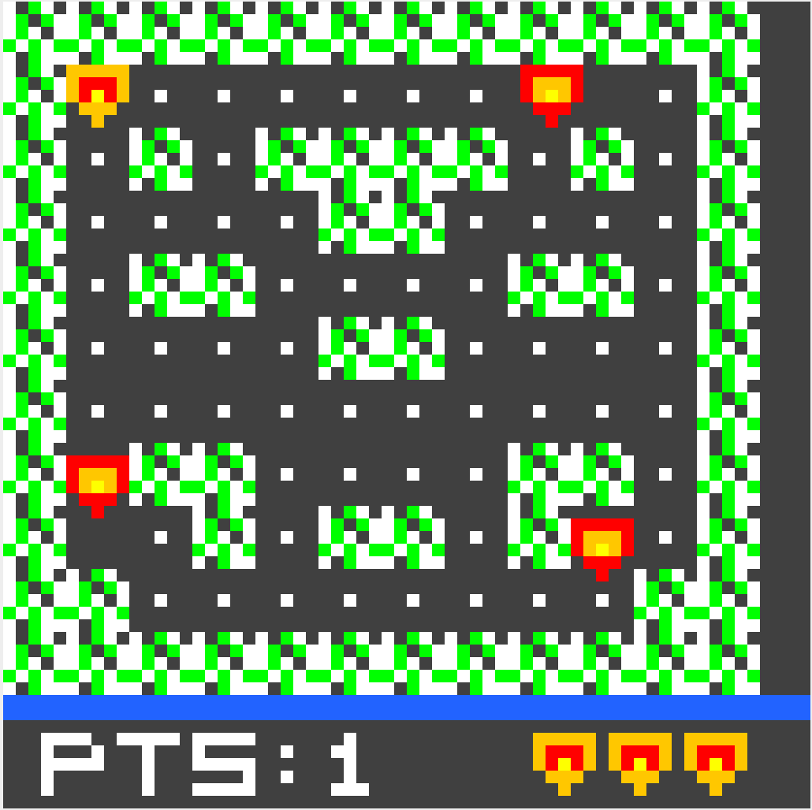
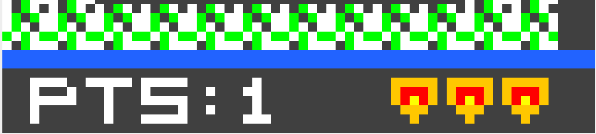
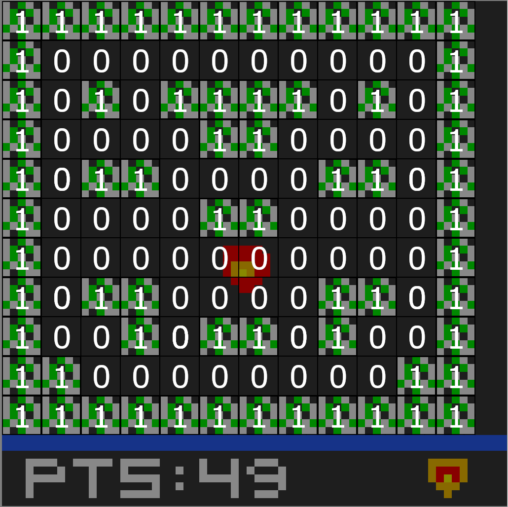

# Project 1 and 2: The MacGuffin Hunter! Creating an interactive game with graphics [^1]

[^1]: Adopted from https://cs0447.gitlab.io/sp2024/projects/02/

# Important: Read this

Please read this document to the end before you start. It contains a lot of useful information that should help you on the project.

Make sure you start by reading/solving Lab 7; it was designed to help you start with this project.

If you haven't, read this [brief introduction to game development](interactive.md).

This repository contains mostly the same files you used in Part B of Lab 7, except the files with the pixel code. Remember to review the [detailed explanation of those files here](helper.md).

Now, we are ready to start!

# Introduction

MacGuffins are great devices, after all. For example, Pac-Man loved his MacGuffins, chomping away and picking them up. Pac-Man was a great game, but we are going to create a way better one: The MacGuffin Hunter!

The MacGuffin Hunter consists of a character the player controls and can move in a particular area. Each tile can be one of two things: (1) a wall and (2) an empty space. Initially, empty spaces will be filled with the most desirable devices: The MacGuffins! And it's the objective of the player to move through the game arena to pick up as many as possible!
The player controls a character that can move through the empty spaces. When the player reaches a MacGuffin, the MacGuffin is picked up.

But be careful. Enemies will spawn on the screen and start capturing MacGuffins as well. And if they catch you, which they will try, you will lose a game life.

The game ends when all the MacGuffins are picked up or when the player runs out of game life. A score is given based on something, such as the time it took the player to clear the arena.

# Start early

The deadline will approach fast! Life happens, sickness happens, so if you start early, you can minimize the impact.

Do a little bit every day! 1 hour every day! 30 minutes every day!

You know you will have questions, and if you decide to ask them in the last couple of days, the teaching team may be unable to answer them all!

# Game elements

## The game arena

The MARS LED display is 64x64 pixels.
You will need to split the screen into two areas.
1. The top area where the action unravels
2. The bottom, where information about the number of points and game lives remaining, is displayed.

It's up to you how much area you want to dedicate to each, but I would use a number of pixels that is a multiple of 5 for the arena. This is because, in the starter code, we give you functions that draw `5x5` blits, right? 

Start your development here.

1. Create some variables to hold how many points and game lives the player has. You may start with three lives, but you decide for your game.
2. Make a function to display this information at the bottom of the screen. **Feel free to display this information as you'd like!** I don't care if I can understand what is represented.
3. Create the platforms.

Check  [this help](helper.md) and look into the functions `display_draw_int`, `display_draw_text`, and `display_blit_5x5` if you want to show numbers or sprites; if you want to show a bar, check function `display_fill_rect`. Have fun with your design :)

Below is one possible approach.

### Implementation hints

The bottom of the screen where the game info is shown should be straightforward! Just create a function that draws what you need and call it every frame!

The walls may be a little more challenging. Blits (drawn with the function `display_blit_5x5`) are `5x5` images, so each tile is a 5x5 block. This means that if the arena is 12x11 tiles (each a 5x5 block), then the usable size in pixels is only 60x55 out of the 64x64 pixels available.

How can you represent an arena of 5x5 blocks? (*Think, Matrix!*)
Maybe `1` for "There is a wall" and `0` for "There is no wall"? The arena can be static. So go ahead and create it manually.

Then, implement the function that prints it on the screen. The first time you print the arena, you may be surprised that it looks sideways. This is because when you have a coordinate in the screen (x, y):
 - x is the column of the matrix!
 - y is the row of the matrix!

You may find it useful to implement some extra functions to help interface the pixel coordinates and the block coordinates, e.g.:

  1. What tile does this pixel belong to?
  2. What are the pixel coordinates for this tile?

Implement these functions, and test them separately!

## The player

The player behaves similarly to the pixels in Lab 7! But it's a 5x5 blit, and there is only one player!

The size of the player increases the bound checks. The player cannot move through all the screen since they cannot go over the information at the bottom or through the arena's walls.

The player starts with several game lives and loses one when it collides with an enemy (see below).
When the player loses a life, it becomes invincible for a while!

While invincible, the player should only **be drawn every other frame** (so that it blinks).
While in this state, it cannot lose another life.

Here, you should follow the same technique suggested in Lab 7: split the implementation into three parts: Model, View, and Control. (Using three separate files is naturally optional but highly advised.)

Once again, the function `display_blit_5x5_trans` will be very useful for drawing the player. As for the player blit, use your imagination!

### Implementation hints

Think about what information about the player you need to keep track of:
  1. x coordinate!
  2. y coordinate!
  3. What does it look like?
  4. Is the player invincible?
  5. How many game lives does it have?

And you may want to implement a function that answers the question:
  1. Is this block inside a wall?

Start by creating the player and placing it on the screen! Done? Ok!

Make the player invincible (manually for test purposes) and ensure it blinks!

Now, you can make the player move left and right (you may write a function `player_move_left_right`) and up and down (you may write a function `player_move_up_down`?) with the keyboard! (Check your solution for Lab 7!)

TEST IN SMALL BATCHES!!! If you write 100 lines and it doesn't work, then it's hard to know where the error is.

Once movement is working, the player cannot leave the screen's bounds, and that is not going through walls.
Knowing if the position to the left/right up/down of the player is inside a wall will be extremely useful.

TEST your implementation by placing the player in different places in the arena and moving it left and right.

When you complete this, your player is (mostly) done!
You must still implement the MacGuffin picking capabilities, but leave that for later.

## MacGuffins

MacGuffins will be spread around the empty blocks of the game arena. Each one will be worth some points.

When the player or an enemy moves on top of a MacGuffin, it picks it up!
So, the fewer MacGuffins the enemies capture, the more points the player can get.

MacGuffins should be animated!

### Implementation hints

Use a similar approach to the board (matrix) to keep track of which tiles contain a MacGuffin.

You can simply have an animation on the MacGuffins. For example, different blits can be displayed in different frames.

## Enemies

You will implement three enemies. At the beginning of the game, enemies pop up in the playing arena, and that doesn't need to be random.

The enemy display is similar to the player, except that you must display multiple enemies.

Enemy movement will be tricky since they have to chase the player.
So, for partial credit, you can make enemies move back and forth (e.g., left-right or up-down).

You can design your enemies as you want, as long as they differ from the player! Once again, have fun.

### Partial Credit
For partial credit, make enemies move left/up and right/down until they cannot continue. When they hit a wall, they should turn around and keep moving in the opposite direction!

### Full Credit
For full credit, the enemies should chase the player! (tricky) How can you do that? It is possible to have the enemies follow a simple algorithm that relies on a variable that stores the direction they are currently moving toward.
Each enemy only changes the direction it is moving if: (1) it cannot keep going (e.g., it hits a wall), or (2) it has 3+ choices to move (e.g., it reaches an intersection).

When an enemy changes direction, it chooses the new movement direction based on which direction minimizes the distance *squared* from the enemy to the player. Thanks, Pythagoras's triangle:

$$(\text{enemy}_x-\text{player}_x)^2 + (\text{enemy}_y-\text{player}_y)^2 = d^2$$

Enemies may (should?) move at a different rate than the player. You can use a similar approach to Lab 7 and use the frame counter in the update function to slow things down. How much slower? You decide.
**Note:** You can move enemies synchronously, i.e., every Xth frame, all enemies move.

### Implementation hints

The first problem to solve is modeling. We have 3 enemies (you can add more if you want) in play! So maybe we should create an array with 3 elements representing the structure that models an enemy as we did with the 3 pixels in the lab.

So, what do we need to model an enemy:
1. We need a position
3. We need to know if the enemy is moving left, right, up, or down
4. A file with the .eqv with the offsets

Now, we just create an array that can hold 3 of these and a function to calculate the address of enemy *i*.

Once the setup is done, display enemies on the screen!

The next step would be to make them all move left and right. There are no controls here, but this is very similar to how you move the player!
**Hint**: Make a function to move one enemy, and call it with the address of the enemy structure as an argument!

When you move each of the enemies, check if it collides with the player, and take a game life of the player if appropriate.

## Collisions

You need to check the collision between the player and the enemy.
Given that enemies and players are 5x5 squares, you need to check if the two boxes (player and enemy) intersect. **Implement a function** to check this and test it thoroughly.

Once you are sure your function is working, collision detection is simple.
1.  Move the player
2. Move the enemies
3. Check for collision with each enemy
  1. If a collision occurs, the (non-invincible) player loses one life.

## Starting and ending the game

When the game starts, it should wait for the player to press any key. Only then should it begin.
The function `input_get_keys` can be helpful.
When the game ends, you should display the player's score. Check `display_draw_int` and `display_draw_text`.

## Project Stages
To help you be aware of your progress, here is a series of mile markers to help you divide the work. You can, of course, ignore these if you wish. However, if you need some direction, follow along.

You have three weeks to complete this project, which can be divided into three stages. You could consider accomplishing each stage for each week, except for the first stage, which you have a little bit more of.

### Stage 1 - The game arena and MacGuffins

Start by displaying the bottom information about the player's lives and the arena with the walls.
See the implementation hints above.

Then, once you are happy with that, add the MacGuffins to the board.

Create the player and make it controllable with the keyboard.

By the end of this stage, make sure the player moves as expected, does not walk through walls, and does not leave the bounds.
Leverage your solution for Lab 7!

Once the player moves correctly, make it collect the MacGuffins.

As a general rule of thumb, I would implement the model first so you can store data. The view second so you can display the data in the model and visualize it. Third, implement the control since you can use the visualization as debug information.

### Stage 2 - Shooting the projectiles and enemies

Once you display the player's info and move the player around, you can move into stage 2!
In this stage, you may ignore collisions between enemies and the player and the player losing game lives. You can handle those later.

Start the enemy implementation. Starting this early will help you make sure you have enough time to implement the full credit movement. Divide the process into smaller implementation bits.
1. Create the model
2. Implement the view
  1. Test these components by forcing some values in the model
3. Implement the control - in phases!
  1. Spawn enemies in the arena
  2. Make them move to the left
  3. Make them collide with walls
  4. Make them turn around/turn into the player

And note how similar these are to the player!

Don't forget that enemies also pick up MacGuffins!

### Stage 3 - Collisions and starting/ending the game

Finally, collisions between the enemies and the player are implemented in the final stage.
Don't forget players should lose a life and become immune to damage if enemies collide!

Add the conditions that terminate the game. Namely, the player reaches 0 lives, or all MacGuffins are picked up.
Don't forget that the game should not start before the player presses a key, and a score should be displayed when the game is over.

This stage should be easier than the previous one, so you may even find time to earn extra credit.

# Helpful Tidbits

### Testing

DO NOT TRY TO WRITE THE WHOLE PROGRAM BEFORE TESTING IT!!!!
 * Really! Do not do it! It's the easiest way to get overwhelmed and confused without knowing what to do!
 * Implement small parts of the code and test them!

### Split your code into functions
Use functions, then use more functions. If your function has more than 40-ish lines of code (not a rule, use your instinct), consider splitting it.

If you have four for-loops, split them into functions!

### Don't create new paradigms
Stick to structures you know (while, for, if, etc.)! And start by planning what the code will do!
It is `0^0` times more difficult to write code if you don't know what it is supposed to do.

Make drawings, write Java code, and write down a paragraph. ANYTHING!

## Grading Rubric (A guideline)

- **[25 points]** Submitted as per instructions
  - No exceptions! Your submission must include files with correct names, and everything asked for in this document! It's all or nothing!
- **[35 points]** Coding style
  - **[20 points]** Commented the code so the grader and I can understand what is happening!
  - **[15 points]** Split code into functions
    - Saved registers
    - Used JAL and JR instructions properly
    - Passed arguments in "a" registers and returned in "v" registers
- **[190 points]:** The game
    - **[25]:** Game flow
		- **[12]** No crashes encountered during regular operation
		- **[13]** Game starts when the player hits any key
    - **[10]** Game ends, somehow, and the score is displayed
    - **[30]:** Arena
		- **[15]** Arena is generated with multiple walls
		- **[15]** Lives and score are kept track of and displayed at the bottom of the screen
	- **[50]:** Player
		- **[10]** Player is drawn
		- **[10]** Player only walks in empty spaces of the arena
		- **[10]** Player moves as specified
		- **[10]** Player loses life when it crashes into an enemy
		- **[10]** Player becomes invincible (and blinks) when it takes damage
	- **[50]:** Enemies
    	- **[15]** At the beginning of the game, at least three enemies are displayed and work
		- **[15]** Move and (at least) reverse direction
		- **[25]** Enemies noticeably chase the player
		- **[20]** Enemies only walk in empty spaces
	- **[25]:** MacGuffins
		- **[10]** MacGuffins are placed on the board
		- **[10]** Player AND enemies pick MacGuffins as they move
		- **[5]** MacGuffins are ainmated!

## Extra credit

### Have fun (up to 10 points: the grader will decide based on difficulty :)
Implement something extra. I will not be strict with what, as long as it improves the gameplay :)
Here are some suggestions:
 - Different enemies. Different enemies have different behaviors (one must still chase the player)
 - Make the arena wrap around, i.e., you can omit a wall on the right/left, and the player wraps around.
 - Make the player shoot bullets to stun an enemy.
  - Do you have an idea? Do it! But don't make it too hard on yourself :)

#### Example of projectile implementation

The projectiles will be shot by the player when B is pressed!

When the player presses B, the game should check if the player faces left/right/up/down (last movement). Depending on the direction the player is facing, the bullet should travel accordingly. The projectile should spawn next to the player.

In each frame, the projectile travels in a straight line. The projectile's speed is up to you, but it should be faster than the player!

If the projectile hits a wall or leaves the bounds of the screen at any point, it is destroyed, and the player can shoot another one.

You can design your projectile as you want. The simplest way will be to use a single pixel, just like in Lab 7. But you can also draw a more elaborate sprite like you did for the player.

#### Implementation hints

If there is only a single projectile on the screen at a time, the model of a projectile is also very simple. It needs:
1. A position
2. A direction of travel (left/right/up/down)
3. A flag indicating if it is active or not (i.e. if it has been shot and not destroyed)

Start by always making the projectile active and in the position where it will be shot from. In other words, the projectile is printed in front of the player! TEST to make sure the code is working.

Then, make the projectile move until it hits a wall or the screen edges. When it does, respawn the projectile next to the player. TEST to make sure the code is working.

Finally, deactivate the projectile and wait for the B button to be pressed! TEST to make sure the code is working.

## Submission

Add the following files to your repository, commit, and push to GitHub, and submit to GradeScope:

All files required to run the game.
    Put your name and username at the top of each file in the comments!
An `InfoSheet.md` file. It should contain:
  -  Your name
  -  Your Pitt username
  -  Anything that does not work
  -  Anything else you think might help the grader grade your project more easily
